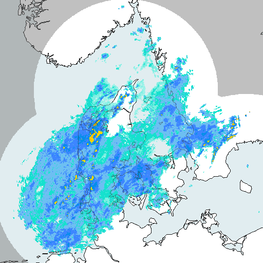
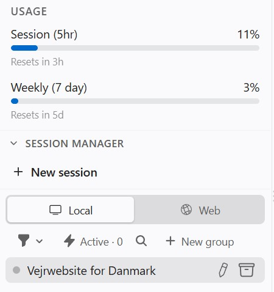

# Flask weather site 
<h4>A Flask weather site generated with Claude.</h4>

Demonstrating access to temperatures and 
radar data, using Claude code. 
 
Steps:
<ul>
<li>Ask <i>Claude</i> for help setting up a Flask website.</li>
<li>Including <i>Static</i> and <i>Template</i> folder (with relevant content).</li>
<li>Then ask <i>Claude</i> for Python code 
for access to temperatures and radar data.</li>
<li>Create the full Flask website.</li>
</ul>
 
 
Claude usage: 
 
Original Flask <a href="https://github.com/SimonLaub/FlaskProject">website</a>.
